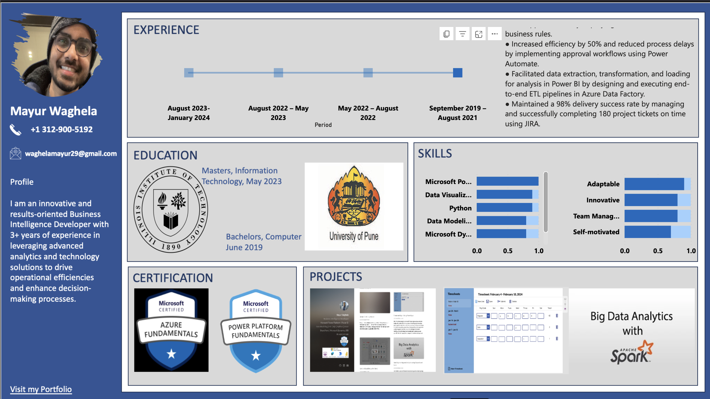

Power BI Resume Report Readme
Overview

This Power BI report serves as a dynamic representation of my resume, showcasing my experiences, projects, certifications, and portfolio. It offers interactive features to explore my professional journey effectively.

Features

Dynamic Data Representation

    The report dynamically presents my resume data, allowing viewers to interact with various components effortlessly.

Experience Timeline

    The experience timeline provides a visual representation of my professional experience.
    Clicking on any point in the timeline reveals detailed information about the specific role, including role description and duration.

Interactive Textbox

    Adjacent to the experience timeline, an interactive textbox dynamically updates to display role descriptions and durations upon clicking on a specific point in the timeline.

Clickable Links

    The report includes clickable links associated with projects, certifications, and portfolio, enabling easy access to additional information.